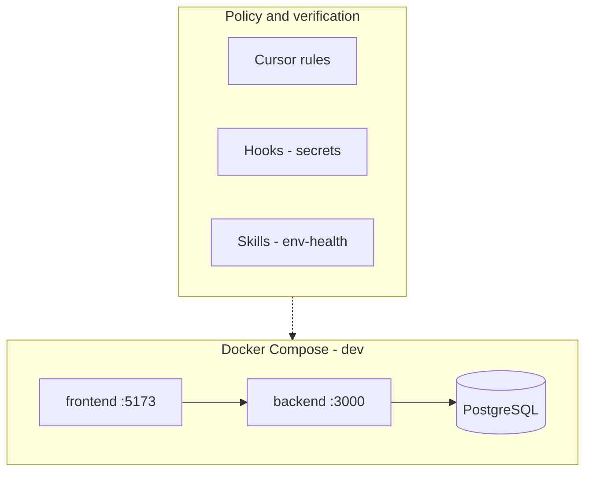

# secdevops-architecture

**Secure, reproducible container architecture and DevSecOps harness** — with explicit policy boundaries for AI-assisted engineering. Intended as a **professional portfolio** artifact for solutions architecture and security-oriented engineering roles.

This repository is **primarily the platform**: Docker/Compose patterns, hardened production images, documentation, and **policy-as-code** in the editor (rules, hooks, skills). A **reference web workload** (Kanban-style frontend/backend) ships here to demonstrate end-to-end wiring; it is **not** the core thesis of the repo.

---

## Audience

Hiring managers and technical reviewers evaluating **systems thinking**, **defense-in-depth**, **supply-chain-aware delivery**, and **traceable automation** (what is enforced vs documented).

---

## Scope boundary

| In scope (primary artifacts) | Out of scope as “the product” |
|------------------------------|-------------------------------|
| Compose topology, profiles, overlays, health ordering | Feature richness of the sample UI/API |
| `Dockerfile.prod` patterns (non-root, multi-stage, minimal runtime) | Production SaaS operation of Kanban |
| `.cursor/` rules, **hooks** (secrets), **skills** (e.g. env health) | Business logic beyond demonstration |
| `docs/` architecture and **controls matrix** | — |

---

## Architecture at a glance



- **Development:** `docker compose -f docker-compose.dev.yml` — bridge network `kanban_network`, bind mounts for hot reload, **Postgres not published** on the host by default (reduced surface).
- **Production images:** multi-stage frontend (static → **unprivileged nginx**); API on **Alpine**, **`npm ci`**, **`USER node`** (see `docs/ARCHITECTURE.md`).
- **Optional:** `dev-workstation` (Compose **profile `tools`**) — SSH/tools container; **not** the app server.

---

## Security posture (summary)

| Control | Mechanism | Where |
|---------|-----------|--------|
| No secrets in VCS | `.gitignore` for `.env`; `.env.example` template | Root |
| Secret-pattern gates | Cursor hooks: shell scan, **Write** pre-scan, post-edit audit | `.cursor/hooks.json`, `.cursor/hooks/*.sh` |
| Least exposure (DB) | Postgres **not** mapped to host unless overlay | `docker-compose.dev.yml` vs `docker-compose.dev.db-host.yml` |
| Prod non-root / minimal runtime | Multi-stage build, `USER node` / unprivileged nginx | `*/Dockerfile.prod` |
| Reproducible installs | `npm ci`, lockfiles in app dirs | Dockerfiles |
| Documented controls | Architecture + matrix | `docs/ARCHITECTURE.md`, `docs/CONTROLS.md` |
| Health verification | Agent skill (no replacement for hooks) | `.cursor/skills/env-health/SKILL.md` |

Full matrix: **[docs/CONTROLS.md](docs/CONTROLS.md)**.

---

## DevSecOps workflow

1. **Develop** — Compose up; inject secrets via **1Password** (`op`) or env files **never committed**.
2. **Enforce** — Hooks block risky secret patterns in shell and **Write** payloads.
3. **Verify** — Invoke **`env-health`** skill for Compose/HTTP/DB checks (see skill file).
4. **Ship** — Build prod images from `frontend/` and `backend/` directories; align runtime secrets with your platform (Vault, SM, K8s secrets, etc.).

---

## AI-assisted engineering harness

- **Rules** (`.cursor/rules/`) encode stack and security **expectations**.
- **Hooks** implement **automated policy** for secret-like patterns (fail-closed where configured).
- **Skills** encode **repeatable verification** workflows so AI-assisted changes stay inside operational guardrails — *policy-as-code complements human review; it does not replace threat modeling or production controls.*

---

## Roadmap (portfolio evolution)

| Item | Status |
|------|--------|
| Multi-app PostgreSQL isolation (separate DB per app vs schema/RBAC) | **Planned** — design doc to follow demand |
| CI pipeline (image scan, compose validate, `npm audit`) | **Planned** |
| Observability (structured logs, health endpoints) | **Planned** |

Implemented vs planned items are labeled honestly for reviewers.

---

## Quick start

```bash
docker compose -f docker-compose.dev.yml up -d
```

| Endpoint | URL |
|----------|-----|
| Reference UI (Vite) | [http://localhost:5173](http://localhost:5173) |
| Reference API | [http://localhost:3000](http://localhost:3000) |

Optional: `--profile tools` for **dev-workstation**; merge **`docker-compose.dev.db-host.yml`** to expose Postgres on `localhost:5432`.

---

## Documentation

| Document | Purpose |
|----------|---------|
| [docs/ARCHITECTURE.md](docs/ARCHITECTURE.md) | Topology, volumes, prod images, secrets conventions |
| [docs/CONTROLS.md](docs/CONTROLS.md) | Security / engineering controls matrix |
| [docs/GITHUB_METADATA.md](docs/GITHUB_METADATA.md) | Suggested GitHub description, topics, About text |

---

## Suggested public repository name

**`secdevops-architecture`** — matches this README title; push this tree to that GitHub repository when ready.

---

## License

MIT — see [LICENSE](LICENSE).
