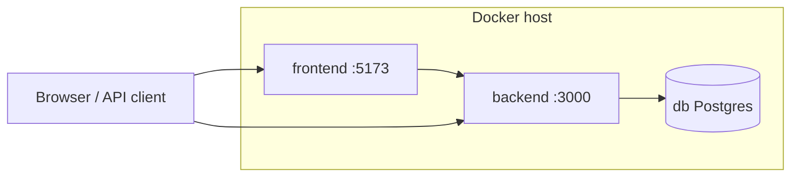
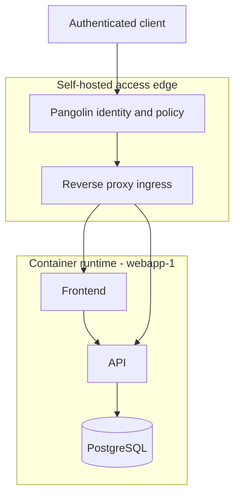

# Architecture and local configuration

This document describes the **Docker-based development setup**, **production** image layout, and **security/productivity** conventions for **`secdevops-architecture`**.

### Portfolio scope

The **primary artifacts** are the **platform**: Compose, Dockerfiles (dev/prod), `.cursor/` policy (rules, hooks, skills), and documentation. The **webapp-1** reference frontend and backend in `frontend/` and `backend/` are a **generic workload** to exercise the stack end-to-end—they are not positioned as the main product of this repository (see root [README.md](../README.md)). Copy the pattern as **webapp-2**, **webapp-3**, etc., when adding more apps. Additional applications can attach to PostgreSQL later using **isolated databases or schemas**; that evolution is **planned** and labeled as such in [CONTROLS.md](CONTROLS.md).

**Portfolio deployment intent:** the production story for this repository is **self-hosted** access and runtime control—using **[Pangolin](https://pangolin.net/)** as the **identity-aware, tunneled reverse-proxy / ZTNA-style edge** (see [Pangolin documentation](https://docs.pangolin.net/)) instead of treating a generic **cloud PaaS** as the default hosting answer. That choice foregrounds **security-oriented design**, **demonstrable skills**, and **operational control** (details in §1.1 below).

---

## 1. High-level architecture

- **Reference application:** React (Vite) frontend, Node (Express) backend, PostgreSQL database.
- **Local development:** Docker Compose runs the stack on a custom bridge network (`webapp1_network`). Source code is bind-mounted so edits on the host appear inside containers (hot reload).
- **Production (images):** Multi-stage / hardened Dockerfiles under `frontend/` and `backend/` (`Dockerfile.prod`); static frontend served by unprivileged nginx; API runs as non-root `node` on Alpine-based images (see section 6).

Optional **role separation** you may use operationally:

- **Docker host** (e.g. Windows + Docker Desktop): runs containers and published ports.
- **Dev workstation** (`dev-workstation` as a hostname or SSH target): editor, Git, **1Password CLI** with desktop integration — secrets injected there, not committed.



### 1.1 Portfolio deployment posture: Pangolin, reverse proxy, and zero trust

This section records a deliberate **hosting and access model** for portfolio reviewers: **self-host the environment** and publish workloads through **Pangolin**, a **reverse-proxy–oriented, identity-aware access layer**, using **zero-trust principles** as the narrative bridge between “secure defaults in code” and “secure defaults at the edge.”

**Why self-hosting (vs cloud-first PaaS as the default story):** managed platforms are valid operationally, but they can hide **where trust boundaries sit** and how **access is granted**. Running your own edge and stacks makes **control** explicit: you choose **what is exposed**, **to whom**, and **how identity is enforced**—which maps cleanly to solutions-architecture and security-engineering interviews.

**Pangolin** is positioned here as the **self-hosted access and publication plane**: an **identity-aware** platform that combines **reverse proxy** capabilities with **tunnel-oriented** connectivity patterns (so internal services are not casually bound to the public Internet). Product behavior and deployment modes evolve; treat **[Pangolin documentation](https://docs.pangolin.net/)** as the source of truth for features (connectors, sites, identity providers, etc.). At the architectural level, Pangolin supports a **deny-by-default** mental model: **nothing is meaningfully reachable until you define and attach access policy** to a published application.

**Reverse proxy** responsibilities at this layer (whether expressed entirely inside Pangolin or alongside it): **TLS termination**, **host/path routing** to upstream services, and a **single ingress discipline** in front of the **webapp-1** containers built from this repo (`Dockerfile.prod` images). The workloads remain **small, non-root, and composable**; the edge carries **authentication, authorization context, and publication policy**.

**Zero trust** (as used in this portfolio): **no implicit trust from “on-network” location alone**; access is **identity- and policy-driven**, **least-privilege**, and **explicitly granted** per resource. That parallels **policy-as-code** in `.cursor/` (rules, hooks, skills): security is expressed as **repeatable controls**—here extended to **who may open a path to the app at all**.

**Skills and signals showcased:** designing for **segmented exposure**, **self-hosted operations**, **inspectable ingress**, and **traceable** security decisions—complementing the DevSecOps automation story in the repository.



---

## 2. Repository layout (relevant paths)

| Path | Role |
|------|------|
| `docker-compose.dev.yml` | Main **local dev** stack (frontend, backend, db). |
| `docker-compose.dev.db-host.yml` | **Optional overlay** — publishes Postgres on `localhost:5432` for GUI clients. |
| `Dockerfile.dev` (repo root) | **Optional** “dev workstation” image (SSH + tools); used only with Compose **profile `tools`**. |
| `frontend/Dockerfile.dev` | Dev image for Vite. |
| `backend/Dockerfile.dev` | Dev image for Express. |
| `frontend/Dockerfile.prod` | Production: build stage + nginx (unprivileged) stage. |
| `backend/Dockerfile.prod` | Production: Node Alpine, `npm ci`, non-root `node`. |
| `frontend/nginx.prod.conf` | SPA + caching rules for production nginx. |
| `.dockerignore` (root + per app) | Smaller build context; excludes `node_modules`, secrets patterns. |
| `.env.example` | Template for local overrides (copy to `.env`; **do not commit** secrets). |
| `.gitignore` | Ignores `.env`, `node_modules`, build artifacts. |
| `.cursor/` | Editor/agent rules, hooks (e.g. secret scanning), skills. |
| `docs/CONTROLS.md` | Security and engineering **controls matrix** (portfolio / audit trail). |

---

## 3. Development stack (`docker-compose.dev.yml`)

### 3.1 Services

| Service | Image / build | Published ports (host) | Purpose |
|---------|----------------|---------------------------|---------|
| **frontend** | `frontend/Dockerfile.dev` | **5173** | Vite dev server; **webapp-1** UI. |
| **backend** | `backend/Dockerfile.dev` | **3000** | Express API. |
| **db** | `postgres:16-alpine` | *(none by default)* | PostgreSQL; reachable as **`db:5432`** from other services. |
| **dev-workstation** | root `Dockerfile.dev` | **2222 → 22** (SSH) | Optional Linux shell + tools; **not** the Vite server. |

### 3.2 Default command (core app + DB)

```bash
docker compose -f docker-compose.dev.yml up -d
```

Starts **frontend**, **backend**, and **db** only.

### 3.3 Compose profile: `tools` (optional dev-workstation)

The **dev-workstation** service is behind **`profiles: [tools]`** so it does **not** run unless requested (saves CPU/RAM and image rebuilds when you only need the app).

```bash
docker compose -f docker-compose.dev.yml --profile tools up -d
```

### 3.4 Optional: Postgres on the host (`localhost:5432`)

By default **PostgreSQL is not exposed** on the host — only containers on `webapp1_network` can connect. This reduces attack surface.

To expose the DB for tools like DBeaver:

```bash
docker compose -f docker-compose.dev.yml -f docker-compose.dev.db-host.yml up -d
```

### 3.5 Startup ordering and health

- **`db`** defines a **`healthcheck`** (`pg_isready`).
- **`backend`** uses **`depends_on: db: condition: service_healthy`** so it starts after the database accepts connections (not only after the container starts).

### 3.6 Networks

- All listed services attach to **`webapp1_network`** (bridge). Service DNS names: **`frontend`**, **`backend`**, **`db`**.

### 3.7 Volumes

| Volume / mount | Purpose |
|----------------|---------|
| **`postgres_data`** (named volume) | Persists PostgreSQL data under `/var/lib/postgresql/data` across container recreation. |
| **`./frontend:/app`** | Live frontend source + `node_modules` behavior per host/container. |
| **`./backend:/app`** | Live backend source. |
| **`.:/workspace`** (dev-workstation only) | Whole repo inside the optional SSH container. |

---

## 4. URLs and environment (development)

| Endpoint | URL / connection |
|----------|------------------|
| webapp-1 UI (Vite) | `http://localhost:5173` |
| API | `http://localhost:3000` |
| Postgres from another container | Host **`db`**, port **5432**, user/db/password **`webapp1`** (see `docker-compose.dev.yml`; Postgres identifiers omit the hyphen). |
| Postgres from host | Not available unless you use **`docker-compose.dev.db-host.yml`**; alternative: `docker compose exec db psql -U webapp1 -d webapp1`. |

Backend reads **`DATABASE_URL`** and **`PORT`** (see `backend/app.js`). Defaults are set in Compose for local dev.

---

## 5. Production images (summary)

Production images below are intended to run **behind** the **self-hosted Pangolin / reverse-proxy edge** described in **§1.1** (not directly exposed without an access policy). Build and pin versions per your environment; wire upstream URLs and TLS at the edge.

| Artifact | Notes |
|----------|--------|
| **`backend/Dockerfile.prod`** | `node:22-alpine`, **`npm ci --omit=dev`**, **`USER node`**, exposes **3000**. |
| **`frontend/Dockerfile.prod`** | Stage 1: `npm ci` + `npm run build`. Stage 2: **`nginxinc/nginx-unprivileged:alpine`**, static files, listens **8080**, non-root **nginx**. |
| **`.dockerignore`** | Keeps contexts small; avoids baking unnecessary files into images. |

Build examples (context = app directory):

```bash
docker build -f backend/Dockerfile.prod backend -t webapp1-api:prod
docker build -f frontend/Dockerfile.prod frontend -t webapp1-web:prod
```

---

## 6. Security and secrets (conventions)

- **No committed secrets:** use **environment variables** and **1Password** (`op inject` / `op run`) on your workstation; keep `.env` out of Git (see `.gitignore` and `.env.example`).
- **Dev Postgres** credentials in Compose are **for local development only** — replace with proper secret management in real deployments.
- **Cursor hooks** (`.cursor/hooks.json`): enforce **secret-pattern** policies — `beforeShellExecution` (`scan-secrets.sh`), `preToolUse` on Write (`scan-secrets-pre-write.sh`), `afterFileEdit` audit (`scan-secrets-after-edit.sh`). These block or warn; they are separate from optional health verification.
- **Agent skill `env-health`** (`.cursor/skills/env-health/SKILL.md`): when invoked, guides **manual verification** of Compose health, HTTP endpoints, DB readiness, and hygiene — it does not replace hooks.
- **Production posture** (from project rules): multi-stage builds, non-root users, named DB volumes in Docker; production Dockerfiles follow that for API and static hosting.

---

## 7. Productivity notes

- **Windows + WSL2 + Docker Desktop:** prefer storing the repo on the **WSL2 Linux filesystem** for faster bind mounts and file watchers than `C:\` paths mounted through WSL.
- **Profiles:** use default `up` for daily app work; add **`--profile tools`** only when you need the SSH **dev-workstation** container.
- **DB exposure:** use the **db-host overlay** only when you need a host GUI client; otherwise keep Postgres internal.

---

## 8. Related configuration files

| File | Role |
|------|------|
| `.cursor/rules/tech-stack.mdc` | Stack expectations (React/Vite, Express, Postgres, Docker). |
| `.cursor/rules/security-standards.mdc` | Dev vs prod Docker and application security expectations. |
| `docs/CONTROLS.md` | Controls matrix (IDs, mechanisms, evidence). |
| `docs/GITHUB_METADATA.md` | Suggested public GitHub **About** text and topics. |

---

## 9. Roadmap (multi-app / isolation)

**Planned (not necessarily implemented in this repo):**

- **Separate PostgreSQL database per application** — strong isolation and simpler backup/restore per product.
- **Alternative:** single cluster with **separate schemas** or **RLS** — lower operational cost; requires clear tenancy design.

Document the chosen model when adding a second application so portfolio readers see an explicit **data-plane** strategy.

---

## 10. Changelog (documentation-relevant)

- **Hosting posture:** portfolio deployment narrative uses **self-hosted [Pangolin](https://pangolin.net/)** with **reverse proxy** ingress and **zero-trust** access principles ([docs](https://docs.pangolin.net/)); see **§1.1**.
- **Naming:** sample app branded **webapp-1**; Docker/Postgres identifiers use **`webapp1`** (no hyphen); bridge network **`webapp1_network`**.
- **Compose profile `tools`:** optional **dev-workstation**; default `up` runs app + DB only.
- **Postgres:** host port **5432** removed by default; optional **`docker-compose.dev.db-host.yml`** overlay.
- **Healthcheck + `depends_on`:** backend waits for **healthy** Postgres.
- **`.gitignore` / `.env.example`:** support local secrets without committing them.
- **Production:** `Dockerfile.prod` in **frontend** and **backend** with non-root and multi-stage frontend build.
- **Portfolio:** README reframed as **secdevops-architecture**; **CONTROLS.md** and **GITHUB_METADATA.md** added.

---

*Last updated to match the repository layout and Compose files in this project. When you change Docker or Compose, update this file and **docs/CONTROLS.md** in the same pull request.*
